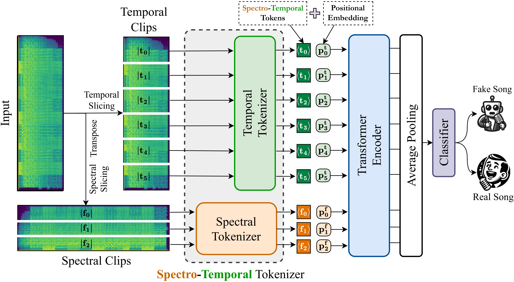

# SONICS: Synthetic Or Not - Identifying Counterfeit Songs

[](https://openreview.net/forum?id=PY7KSh29Z8)  [](https://arxiv.org/abs/2408.14080)  [](https://huggingface.co/awsaf49/sonics)  [](https://huggingface.co/datasets/awsaf49/sonics)  [](https://huggingface.co/spaces/sonics-dl-group/sonics-song-leaderboard)  [](https://creativecommons.org/licenses/by-nc/4.0/)

This repository contains the official source code for our paper **SONICS: Synthetic Or Not - Identifying Counterfeit Songs**.


## 📌 **Abstract**
The recent surge in AI-generated songs presents exciting possibilities and challenges. These innovations necessitate the ability to distinguish between human-composed and synthetic songs to safeguard artistic integrity and protect human musical artistry. Existing research and datasets in fake song detection only focus on singing voice deepfake detection (SVDD), where the vocals are AI-generated
but the instrumental music is sourced from real songs. However, these approaches are inadequate for detecting contemporary end-to-end artificial songs where all components (vocals, music, lyrics, and style) could be AI-generated. Additionally, existing datasets lack music-lyrics diversity, long-duration songs, and open-access fake songs. To address these gaps, we introduce SONICS, a novel dataset
for end-to-end Synthetic Song Detection (SSD), comprising over 97k songs (4,751 hours) with over 49k synthetic songs from popular platforms like Suno and Udio. Furthermore, we highlight the importance of modeling long-range temporal dependencies in songs for effective authenticity detection, an aspect entirely overlooked in existing methods. To utilize long-range patterns, we introduce SpecTTTra, a novel architecture that significantly improves time and memory efficiency over conventional CNN and Transformer-based models. For long songs, our top-performing variant outperforms ViT by 8% in F1 score, is 38% faster, and uses 26% less memory, while also surpassing ConvNeXt with a 1% F1 score gain, 20% speed boost, and 67% memory reduction.

## Spectro Temporal Tokenizer



## System Configuration

- Disk Space: 150GB
- GPU Memory: 48GB
- RAM: 32GB
- Python Version: 3.10
- OS: Ubuntu 20.04
- CUDA Version: 12.4

## Installation

```
python -m venv .venv
source .venv/bin/activate
pip install -r requirements.txt
```

## Dataset 

After downloading the dataset, the folder structure should look like following:

```
parentFolder
│
├──sonics
│
├──dataset
│       ├──real_songs  
│       │   └──xxx.mp3 
│       ├──fake_songs
│       │   └──yyy.mp3
│       ├──real_songs.csv
│       └──fake_songs.csv
```

To split it into train, val, and test set, we will need to run the following command from the parent folder

```shell
python data_split.py
```

> **Note:** The `real_songs.csv` and `fake_songs.csv` contain the metadata for the songs including filepath, duration, split, etc and config file contains path of the metadata.

> **Note:** Output files including checkpoints, model predictions will be saved in `./output/<experiment_name>/` folder.

## Training

Choose any of the config from `config` folder and run the following

```shell
python train.py --config <path to the config file>
```

## Testing

Choose any of the config from `config` folder and run the following

```shell
python test.py --config <path to the config file> --ckpt_path <path to the checkpoint file>
```

## Model Profiling

Choose any of the config from `config` folder and run the following
```shell
python model_profile.py --config <path to the config file> --batch_size 12
```

## Acknowledgement

We have utilized the code and models provided in the following repository:

- [Pytorch Image Models](https://github.com/huggingface/pytorch-image-models)